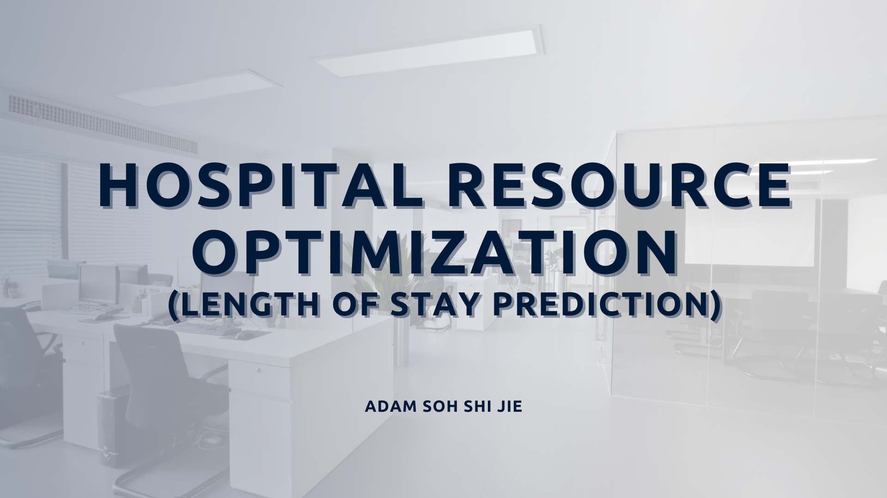

# Hospital Resource Optimization Project

**NTU College of Computing and Data Science**

## BC2406 Analytics 1: Visual & Predictive Techniques | Computer-Based Assessment

  

This repository contains the work for a data science project aimed at optimizing hospital resource allocation and predicting patient length of stay (LoS) using machine learning techniques. The project leverages real-world data to develop predictive models and provides actionable insights to enhance healthcare operations.

---

## Overview

The project focuses on analyzing patient data from various hospital service areas to:
- Identify factors influencing length of stay (e.g., severity of illness, emergency cases).
- Build predictive models for accurate LoS estimation.
- Recommend strategies to optimize resource allocation and improve hospital efficiency.

---

## Key Features

1. **Data Analysis**
   - Exploratory Data Analysis (EDA) to uncover trends and relationships between variables.
   - Identification of significant predictors, such as total charges, total costs, and patient demographics.

2. **Predictive Modeling**
   - Developed Linear Regression and CART models with an RMSE of ~5.9 days.
   - Optimized CART using pruning techniques to avoid overfitting.

3. **Recommendations**
   - Proposed strategies for resource allocation, emergency service prioritization, and financial planning.
   - Suggested advanced modeling techniques (e.g., Random Forest) and real-time data integration for enhanced decision-making.

---

## Technical Details

- **Programming Language:**
  - R
- **Techniques Implemented:**
  - Data Cleaning and Feature Selection
  - Linear Regression
  - Classification and Regression Trees (CART)
  - Model Evaluation (RMSE)

---

## Insights

- Emergency care dominates hospital admissions across all service areas, underscoring the need for prioritization in resource allocation.
- Longer stays require focused resource management due to their impact on hospital operations and financial planning.
- Predictive models provide valuable tools for better capacity planning and patient care.

---

## Future Enhancements

- Incorporate advanced models like Random Forest to capture non-linear relationships.
- Add features like seasonality to improve prediction accuracy.
- Implement real-time data integration systems for dynamic resource management.

---

## Contributors

- **Adam Soh Shi Jie**

---

## License

This project is licensed under the [MIT License](LICENSE).

